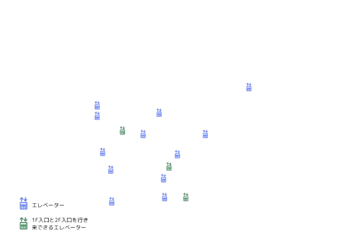

<!DOCTYPE html>
<html lang="ja">
<head>
  <meta charset="UTF-8">
  <title>キャンパスマップ - 門表示</title>
  
</head>
<body>

  <header>
    <h1>お茶の水女子大学カスタムキャンパスマップ</h1>
    
お茶の水女子大学の地図を用途別に表示できます。表示したい項目を選択してください。

  </header>

  <main>
    <button onclick="toggleGate()">オストメイト</button>
    <button onclick="toggleAED()">スロープ</button>
    <button onclick="toggleElevator()">エレベーター</button>
    <button onclick="toggleNursing()">段差</button>
    <button onclick="toggleRestArea()">点字ブロック</button>
    <button onclick="toggleSlope()">随時情報を追加</button>
    

      
      
      
      
      
      
      
    

  </main>

  <footer>
    
 2025年5月7日更新　Made by 生活科学部人間環境科学科　市川・濱田・松原・新野(2023年度入学世代)

  </footer>

  
</body>
</html>
